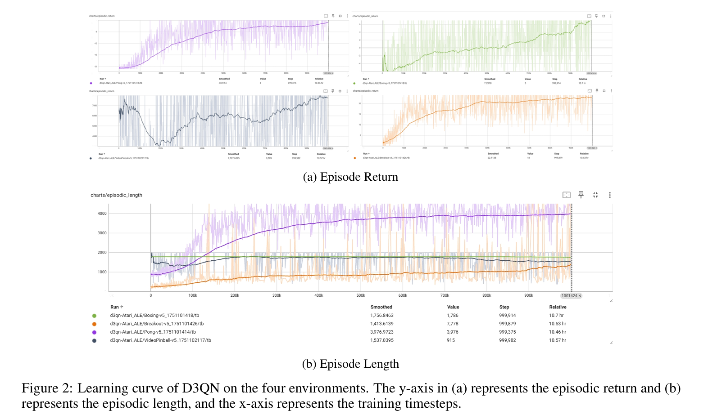
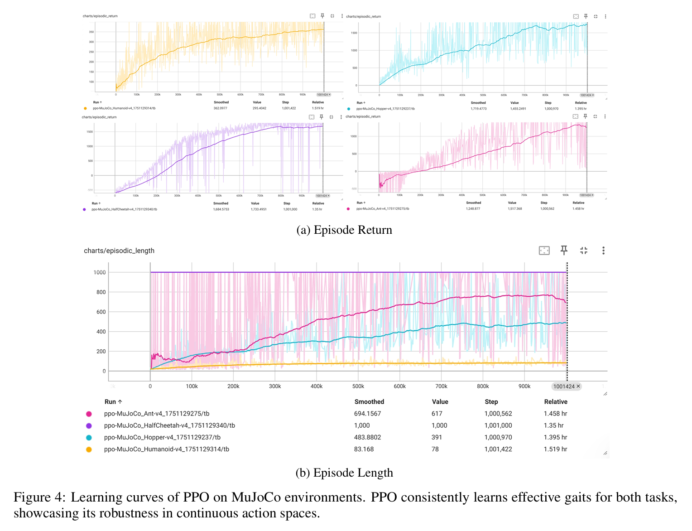
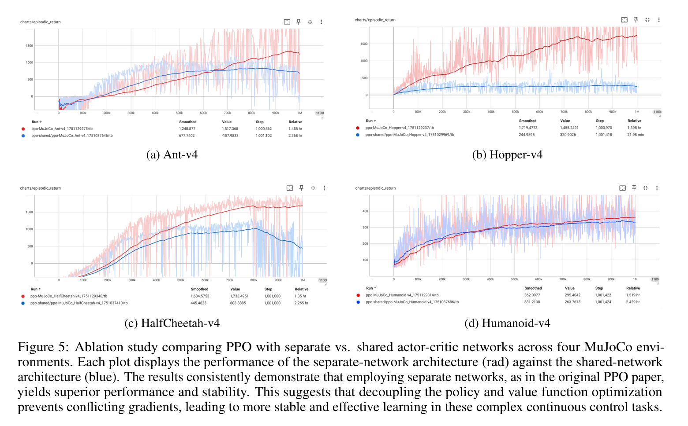

# SJTU_CS3316_RL Final Project

[](https://www.python.org/downloads/) [](https://pytorch.org/)  [](https://opensource.org/licenses/MIT)

This is the final project for the Reinforcement Learning course (CS3316), featuring implementations and evaluations of two major families of model-free Deep Reinforcement Learning (DRL) algorithms. The project aims to replicate and analyze state-of-the-art algorithms, with a focus on code quality, modularity, and empirical validation on standard benchmarks.

## 📖 Abstract

> Deep Reinforcement Learning (DRL) has emerged as a powerful paradigm for solving complex sequential decision-making problems. This report presents a comprehensive implementation and evaluation of two prominent families of model-free DRL algorithms: policy-based **Proximal Policy Optimization (PPO)** and value-based **Dueling Double Deep Q-Network (D3QN)**. We apply PPO to high-dimensional continuous control tasks from the MuJoCo suite and D3QN to classic Atari games. Our work provides a detailed analysis of the theoretical underpinnings of these algorithms, a robust and modular codebase, and empirical results that highlight their respective strengths and weaknesses in different domains.

[**➡️ View Full Project Report**](.RL_Project_Report.pdf)

---

## ✨ Features

-   **Two Core RL Families**:
    -   🤖 **Policy-Based**: **Proximal Policy Optimization (PPO)**, designed for continuous control tasks like MuJoCo (`Hopper-v4`, `Ant-v4`).
    -   🎮 **Value-Based**: **Dueling Double Deep Q-Network (D3QN)**, excelling in high-dimensional visual tasks like Atari 2600 (`Breakout-v5`, `VideoPinball-v5`).
-   **🔧 Modular & High-Quality Code**: Clean, commented, and organized by algorithm (`agents/`) and functionality (`utils/`), making it easy to understand, maintain, and extend.
-   **⚙️ Configuration-Driven**: All hyperparameters are managed through `.yaml` files, making experiments easy to configure and reproduce.
-   **📊 Integrated Logging & Visualization**: Seamlessly logs to **TensorBoard** for real-time monitoring of training rewards, losses, and other key metrics.
-   **🎥 Comprehensive Evaluation**: Includes dedicated scripts to evaluate trained agents, generate performance statistics, render gameplay live, and record videos.
-   **🔬 Ablation Studies**: In-depth analysis of architectural choices in PPO (shared vs. separate actor-critic networks) to understand their impact on performance.

---

## 📂 Project Structure

```
Reinforcement_Learning_Final_Project/
├── agents/
│   ├── d3qn/                  # Dueling Double DQN Agent
│   │   ├── agent.py
│   │   └── model.py
│   ├── ppo/                   # Proximal Policy Optimization Agent
│   │   ├── agent.py
│   │   └── model.py
│   └── muzero/                # (Future Work) MuZero Agent
├── configs/
│   ├── d3qn.yaml              # D3QN configuration example
│   └── ppo.yaml               # PPO configuration example
├── envs/
│   └── atari_wrappers.py      # Preprocessing wrappers for Atari
├── utils/
│   ├── replay_buffer.py       # Replay Buffer
│   ├── logger.py              # Logger (for TensorBoard)
│   └── scheduler.py           # Schedulers for learning rate/exploration
├── visualization/             # (Generated gameplay videos are saved here)
│
├── run.py                     # Main training script
├── evaluate.py                # Evaluation and visualization script
├── requirements.txt           # Project dependencies
└── README.md
```

---

## 🚀 Getting Started

### 1. Prerequisites

-   Python 3.8+
-   [PyTorch](https://pytorch.org/) (version with CUDA support is recommended)
-   An environment with MuJoCo and/or Atari ROMs installed.

### 2. Installation

1.  **Clone the repository:**
    ```bash
    git clone https://github.com/SuJQ0722/SJTU_CS3316_RL.git
    cd SJTU_CS3316_RL
    ```

2.  **Create and activate a virtual environment (recommended):**
    ```bash
    python -m venv venv
    source venv/bin/activate  # On Windows, use: venv\Scripts\activate
    ```

3.  **Install dependencies:**
    ```bash
    pip install -r requirements.txt
    ```
    > **Note:** For Atari environments, you may need to import the ROMs manually:
    > `ale-import-roms --import-from-pkg ale_py.roms`

---

## 🕹️ How to Use

### 1. Train an Agent

Use the `run.py` script to start training. You need to specify the environment name(--env_name).
The environments available now are
- MuJoCo
    - Hopper-v4
    - Ant-v4
    - Humanoid-v4 
    - HalfCheetah-v4
- Atari 
    - Breakout-v5
    - Boxing-v5
    - Pong-v5
    - VideoPinball-v5

**Train PPO:**
```bash
python run.py --env_name {ATARI_ENV}
```

**Train D3QN:**
```bash
python run.py --env_name {MUJOCO_ENV}
```
Training logs and model checkpoints will be saved to a timestamped directory (e.g., in `models/`).

### 2. Monitor with TensorBoard

While training, you can monitor performance curves in real-time.

1.  Open a new terminal.
2.  Run the following command:
    ```bash
    tensorboard --logdir models
    ```
3.  Open `http://localhost:6006/` in your web browser.

### 3. Evaluate and Visualize

Use the `evaluate.py` script to test a trained model.

-   **Option 1: Numerical Evaluation** (runs for N episodes and reports the average score)
    ```bash
    python evaluate.py --env_name {env_name} --config configs/ppo.yaml --model_path path/to/your/ppo_model.pth
    ```

-   **Option 2: Live Rendering** (watch the agent play in real-time)
    Add the `--render` flag.
    ```bash
    python evaluate.py --env_name {env_name} --config configs/d3qn.yaml --model_path path/to/your/d3qn_model.pth --render
    ```

-   **Option 3: Record a Video** (save the gameplay as an `.mp4` file)
    Add the `--record` flag. The video will be saved in the `visualization/` directory.
    ```bash
    python evaluate.py --env_name {env_name} --config configs/ppo.yaml --model_path path/to/your/ppo_model.pth --record
    ```

---

## 📈 Results & Key Findings

Our experiments yielded several key insights:

-   **PPO's Architecture is Crucial**: In our ablation study on PPO, we found that using **separate actor and critic networks** (as described in the original paper) consistently yields superior performance and stability compared to a shared-network architecture in MuJoCo tasks. This suggests that decoupling the optimization objectives prevents conflicting gradients.

-   **Intriguing Learning Dynamics in `VideoPinball-v5`**: The D3QN agent exhibited a unique learning pattern in this environment: an initial high score from random-like behavior, followed by a performance dip, and then a final recovery to a superior policy. This phenomenon was strongly correlated with the Q-loss, highlighting how the agent must "unlearn" a simplistic strategy to master a more robust, causal one.

### D3QN Performance on Atari Games



### PPO Performance on MuJoCo



### PPO Ablation Study: Separate vs. Shared Networks



---


## 🔮 Future Work

-   **[ ] Implement MuZero**: As a bonus, we plan to implement **MuZero**, a state-of-the-art model-based RL algorithm. Unlike the model-free methods implemented so far, MuZero learns its own model of the environment dynamics and uses Monte-Carlo Tree Search (MCTS) for planning, representing another frontier of DRL.
-   **[ ] Broader Hyperparameter Search**: Conduct a more extensive search for optimal hyperparameters for each algorithm-environment pair.
-   **[ ] Tackle More Complex Environments**: Test the implemented agents on more challenging benchmarks, such as the Procgen suite for generalization.

## 🙏 Acknowledgements

This project was completed for the Reinforcement Learning course at Shanghai Jiao Tong University. Special thanks to Prof. Zou and TA Yuyang Huang for their guidance and support.

## 📚 References

For a complete list of citations, please refer to the `References` section in the [full project report](./RL_Project_Report.pdf).